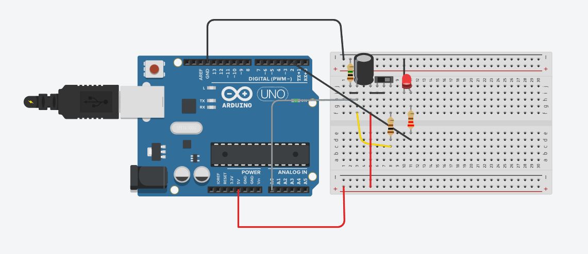

## Ponderada 2

### Led ligado

O led acende quando a chave ( interruptor ) é ligado.

<div align="center">
 <sub>Led ligado</sub><br><br>
 <br>
 <sub>Fonte autoral</sub>
</div>

---

### Led desligado

Após desligar a chave ( interruptor ) o led demora para apagar. Ele se apaga apenas quando a segunda coluna do monitor serial chega a um valor inferior à 3.00.

<div align="center">
 <sub>Led desligado</sub><br><br>
 <br>
 <sub>Fonte autoral</sub>
</div>

---

### Link para o projeto no Tinkercad

[Clique aqui](https://www.tinkercad.com/things/7u5QnixuSj1-funky-rottis/editel?returnTo=https%3A%2F%2Fwww.tinkercad.com%2Fdashboard%2Fdesigns%2Fcircuits)

### Código

```
int pinoNoRC = 0; 
int valorLido = 0;
int pinoLED = 2;
float tensaoCapacitor = 0, tensaoResistor;
unsigned long time;

void setup() { 
  Serial.begin(9600); 
  pinMode(2, OUTPUT); // Configura pino 2 como saída para LED
} 

void loop() { 
  time = millis(); 
  valorLido = analogRead(pinoNoRC); 
  tensaoResistor = (valorLido * 5.0 / 1023); // 5.0V / 1023 degraus = 0.0048876 
  tensaoCapacitor = abs(5.0 - tensaoResistor);

  // Aqui insere a lógica do LED
  if (tensaoResistor > 3.0) {
    digitalWrite(2, HIGH); // Acende o LED se tensão > 3V
  } else {
    digitalWrite(2, LOW);  // Apaga o LED caso contrário
  }

  Serial.print(time); // imprime o conteúdo de time no MONITOR SERIAL
  Serial.print(" "); 
  Serial.print(tensaoResistor);
  Serial.print(" ");
  Serial.println(tensaoCapacitor); 
  delay(400); 
}
```